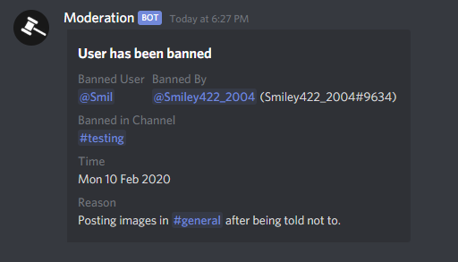

# Moderation Commands

## Announce


This command is deprecated and will no longer work soon.



This command is disabled.


### What this command does

The announce command is an easy way to get the attention of your members.

### How to use it

The announce command takes only one argument: the description of the announcement.

To use the command, simply type c;announce &lt;your text here&gt;

```text
c;announce Hello world! This is an example of the announce command.
```


This command supports markdown, so you can embed links into the messages too!


## Announce2


This command name may be changed in the future.



This command is disabled.


### What this command does

The announce2 command is a better version of the announce command. This command supports the customization of a title and description.

### How to use it

This command has two arguments that are both required: the title and description.

To use this command, simply type c;announce2 &lt;Title here&gt;\|&lt;Description here&gt;

```text
c;announce2 Hey there! This is the title!|And this is the description.
```


To separate between the title and description, use the "**\|**" \(horizontal bar\) symbol.


## Ban


This command requires that you have the **BAN\_MEMBERS** permission in order to function.


### What this command does

This command is an easy way to ban someone.

### How to use it

The commands requires two arguments: the user and the reason.

Simply type c;ban \[@user\] \[reason\] and you're all set!

```text
c;ban @Smil Posting images in #general after being told not to.
```

This commands yields the following:



## Global Announcements


This command is restricted for all members except for users with the **Global Announcer** role.


### What this command does

This command sends an announcement to multiple channels in the Discord server. It will never DM users.

### How to use it

For security reasons, the arguments of the command is not shown.

## ID Ban


This command requires you to have the **BAN\_MEMBERS** permission.


### What this command does

This command allows you to ban a user from the Discord server if you have their user ID, regardless if they've joined the server before.

### How to use it

This command has two arguments: the user ID and the reason.

Simply type c;idban \[user ID\] &lt;reason&gt; and you're all set!

```text
c;idban 239175968168607744 Raiding.
```

## Kick


This command requires you to have the **KICK\_MEMBERS** permission.


### What this command does

This command allows you to kick a member from the Discord server.

### How to use it

This command takes two arguments: the user and the reason.

Simply type c;kick \[@user\] \[reason\]

```javascript
c;kick @Smiley Toxic behaviour.
```

## Mute


This command requires you to have the **MANAGE\_MESSAGES** permission.



It is not recommended to mute a user for more than one hour at a time, because if the bot goes offline, the role may not be removed from the user.


### What this command does

The mute command temporarily prohibits the user from talking in channels, joining voice channels, and reacting to messages.

### How to use it

To use the mute command, simply type c;mute \[@user\] \[h/m/s\] \[reason\] and you're all set.

```javascript
c;mute @Smiley 10m Spamming messages.
```

## Purge


This command requires you to have the **MANAGE\_MESSAGES** permission.



A maximum of 100 messages can be deleted at once. Messages older than 14 days cannot be deleted by bots, per the Discord API.


### What this command does

This command allows you to bulk delete a certain amount of messages in the channel you type the command in.

### How to use it

Simply type c;purge \[number of messages\] and watch the magic happen.

## Slowmode


This command requires you to have the **MANAGE\_MESSAGES** permission.



THe number of seconds can be any number between 1 and 21600 \(6 hours\)


### What this command does

This command allows you to enable a custom slowmode timer in the channel.

### How to use it

Simply type `c;slowmode` \[number of seconds\] and you're all set.

## Unban


This command requires you to have the **BAN\_MEMBERS** permission.


### What this command does

This command allows you to unban members.

### How to use it

This command requires two arguments: the user ID and the reason.

Simply type c;unban \[user ID\] \[reason\]

```javascript
c;unban 239175968168607744 Appeal was successful.
```

## Unmute


This command requires you to have the **MANAGE\_MESSAGES** permission.


### What this command does

This command allows you to unmute a user.

### How to use it

Simply type `c;unmute [@user]` and you're all set!

## Warn


This command requires you to have the **MANAGE\_MESSAGES** permission.


### What this command does

This command will warn a user in the Discord server.

### How to use it

This command takes two arguments: the user and the reason.

Simply type `c;warn [@user] [reason]` and it's done!

